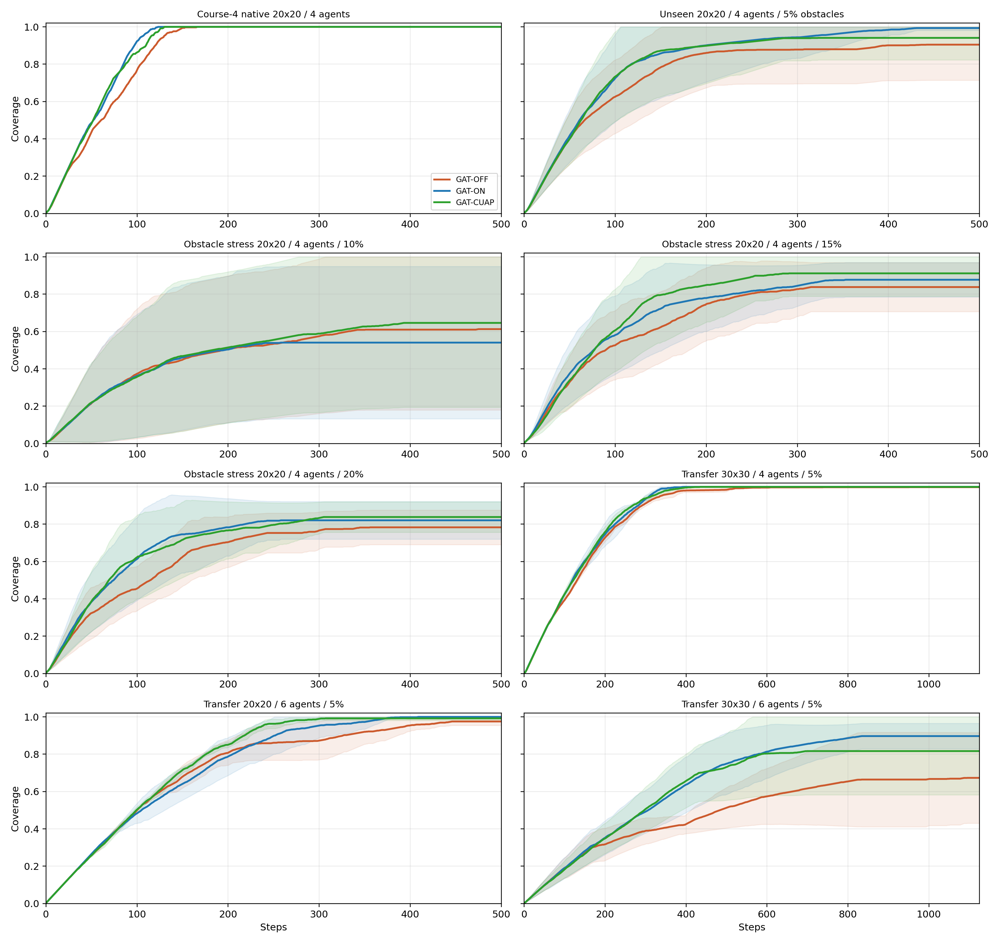
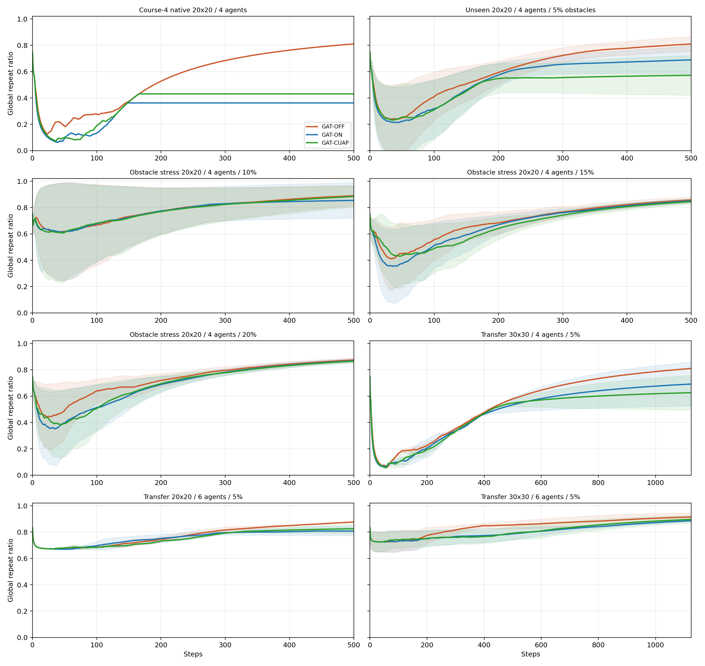
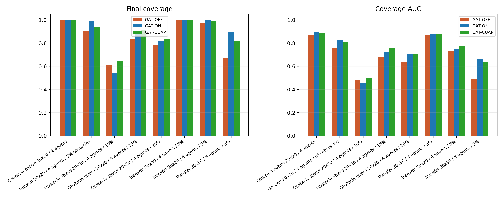
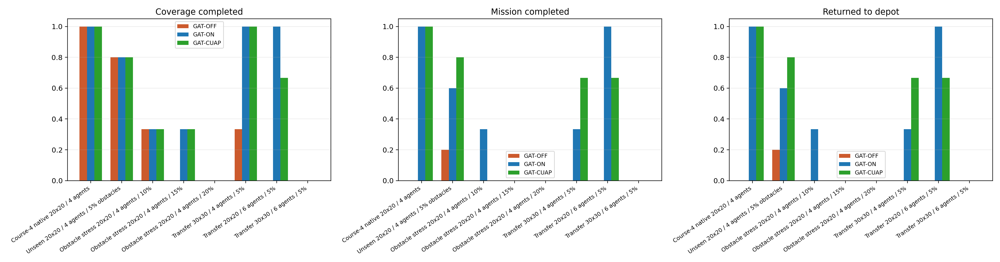
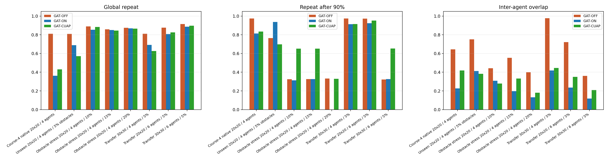
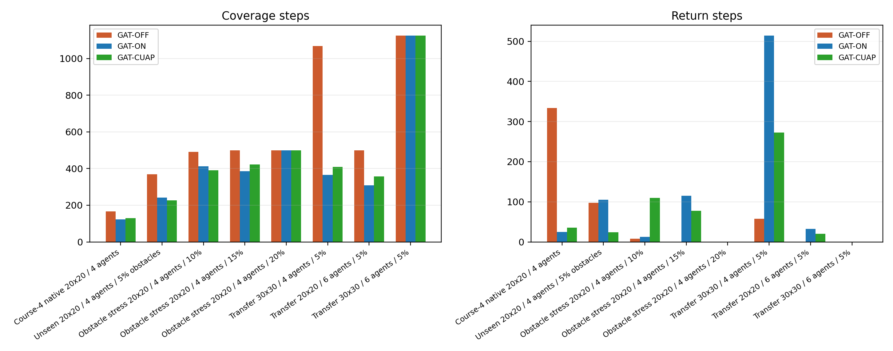
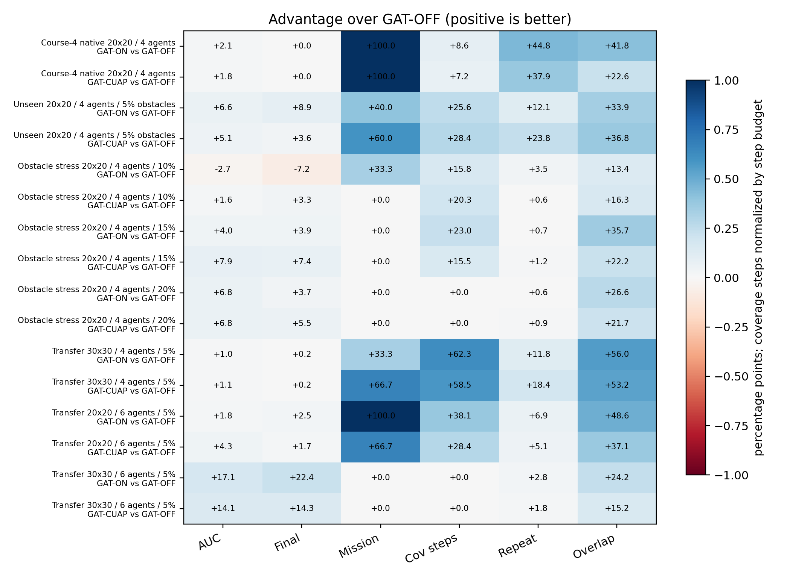
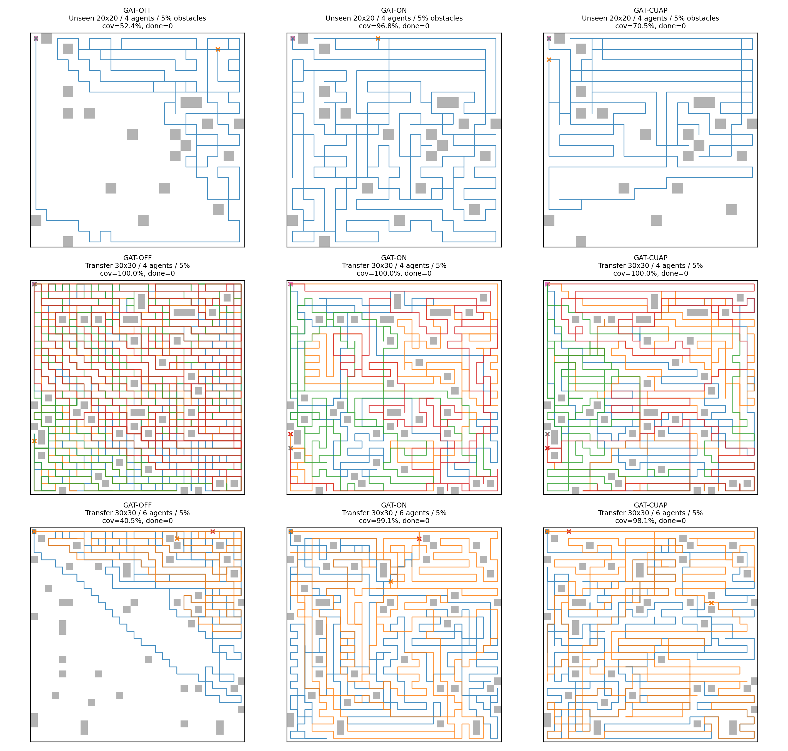

# Three-model ablation: GAT-OFF vs GAT-ON vs GAT-CUAP

This report evaluates trained checkpoints with deterministic offline rollouts. No additional PPO training is performed.

## Checkpoints

- GAT-OFF coverage: `D:\projects\GAT-MAPPO\MCPP\outputs\ablation_mapmsg_gat_off_nocomm\depot_return_pipeline\coverage\04-tier-4-20x20-4agents\best_policy.pt`
- GAT-ON coverage: `D:\projects\GAT-MAPPO\MCPP\outputs\ablation_mapmsg_gat_on\depot_return_pipeline\coverage\04-tier-4-20x20-4agents\best_policy.pt`
- GAT-CUAP coverage: `D:\projects\GAT-MAPPO\MCPP\outputs\ablation_mapmsg_gat_on_cuap\depot_return_pipeline\coverage\04-tier-4-20x20-4agents\best_policy.pt`
- Shared return policy: `D:\projects\GAT-MAPPO\MCPP\outputs\ablation_mapmsg_gat_off_nocomm\depot_return_pipeline\return_diverse_scale60\04-tier-4-20x20-4agents\policy.pt`

## Experimental Setup

- Task: depot-return coverage. The coverage policy acts until the environment enters return mode; all arms then use the same return policy.
- GAT-OFF is the no-communication explicit-memory baseline from `ablation_mapmsg_gat_off_nocomm`.
- GAT-ON enables shared map memory, coverage messages, and range-limited multi-head GAT.
- GAT-CUAP keeps the GAT-ON architecture and adds the CUAP action-prior logits during coverage.
- Main metrics: Coverage-AUC, final coverage, coverage completion, mission completion, coverage steps, repeated visits, and inter-agent overlap.

## Key Findings

- Best overall Coverage-AUC across non-native scenarios: GAT-CUAP (72.4%).
- Best overall final coverage across non-native scenarios: GAT-CUAP (87.8%).
- Best overall mission completion across non-native scenarios: GAT-ON (32.4%).
- Best overall global repeat across non-native scenarios: GAT-CUAP (78.8%).
- Best overall inter-agent overlap across non-native scenarios: GAT-ON (26.0%).
- GAT-CUAP vs GAT-ON average Coverage-AUC delta: +0.009; global repeat delta: -0.019.
- GAT-ON vs GAT-OFF average Coverage-AUC delta: +0.050.
- Per-scenario Coverage-AUC wins: GAT-OFF: 0, GAT-ON: 3, GAT-CUAP: 5.

## Scenario Summary

| Scenario | Arm | Ep. | Final cov. | AUC | Cov done | Mission done | Returned | Steps | Cov steps | Return steps | Repeat90 | Overlap |
| --- | --- | ---: | ---: | ---: | ---: | ---: | ---: | ---: | ---: | ---: | ---: | ---: |
| Course-4 native 20x20 / 4 agents | GAT-OFF | 1 | 100.0% | 0.874 | 100.0% | 0.0% | 0.0% | 500.0 | 166.0 | 334.0 | 97.5% | 64.5% |
| Course-4 native 20x20 / 4 agents | GAT-ON | 1 | 100.0% | 0.894 | 100.0% | 100.0% | 100.0% | 148.0 | 123.0 | 25.0 | 81.4% | 22.6% |
| Course-4 native 20x20 / 4 agents | GAT-CUAP | 1 | 100.0% | 0.892 | 100.0% | 100.0% | 100.0% | 166.0 | 130.0 | 36.0 | 83.5% | 41.8% |
| Unseen 20x20 / 4 agents / 5% obstacles | GAT-OFF | 5 | 90.5% | 0.760 | 80.0% | 20.0% | 20.0% | 467.2 | 369.4 | 97.8 | 76.5% | 75.1% |
| Unseen 20x20 / 4 agents / 5% obstacles | GAT-ON | 5 | 99.4% | 0.826 | 80.0% | 60.0% | 60.0% | 346.4 | 241.4 | 105.0 | 93.7% | 41.2% |
| Unseen 20x20 / 4 agents / 5% obstacles | GAT-CUAP | 5 | 94.1% | 0.810 | 80.0% | 80.0% | 80.0% | 251.6 | 227.2 | 24.4 | 69.8% | 38.3% |
| Obstacle stress 20x20 / 4 agents / 10% | GAT-OFF | 3 | 61.3% | 0.481 | 33.3% | 0.0% | 0.0% | 500.0 | 491.7 | 8.3 | 32.6% | 44.2% |
| Obstacle stress 20x20 / 4 agents / 10% | GAT-ON | 3 | 54.1% | 0.454 | 33.3% | 33.3% | 33.3% | 425.3 | 412.7 | 12.7 | 31.3% | 30.8% |
| Obstacle stress 20x20 / 4 agents / 10% | GAT-CUAP | 3 | 64.6% | 0.497 | 33.3% | 0.0% | 0.0% | 500.0 | 390.3 | 109.7 | 65.1% | 27.9% |
| Obstacle stress 20x20 / 4 agents / 15% | GAT-OFF | 3 | 83.8% | 0.683 | 0.0% | 0.0% | 0.0% | 500.0 | 500.0 | 0.0 | 32.6% | 55.4% |
| Obstacle stress 20x20 / 4 agents / 15% | GAT-ON | 3 | 87.7% | 0.723 | 33.3% | 0.0% | 0.0% | 500.0 | 385.0 | 115.0 | 32.6% | 19.7% |
| Obstacle stress 20x20 / 4 agents / 15% | GAT-CUAP | 3 | 91.2% | 0.762 | 33.3% | 0.0% | 0.0% | 500.0 | 422.7 | 77.3 | 65.2% | 33.2% |
| Obstacle stress 20x20 / 4 agents / 20% | GAT-OFF | 3 | 78.3% | 0.641 | 0.0% | 0.0% | 0.0% | 500.0 | 500.0 | 0.0 | 33.3% | 39.9% |
| Obstacle stress 20x20 / 4 agents / 20% | GAT-ON | 3 | 82.1% | 0.708 | 0.0% | 0.0% | 0.0% | 500.0 | 500.0 | 0.0 | 0.0% | 13.2% |
| Obstacle stress 20x20 / 4 agents / 20% | GAT-CUAP | 3 | 83.9% | 0.708 | 0.0% | 0.0% | 0.0% | 500.0 | 500.0 | 0.0 | 33.0% | 18.1% |
| Transfer 30x30 / 4 agents / 5% | GAT-OFF | 3 | 99.8% | 0.869 | 33.3% | 0.0% | 0.0% | 1125.0 | 1067.3 | 57.7 | 97.5% | 97.8% |
| Transfer 30x30 / 4 agents / 5% | GAT-ON | 3 | 100.0% | 0.880 | 100.0% | 33.3% | 33.3% | 880.7 | 366.3 | 514.3 | 91.4% | 41.8% |
| Transfer 30x30 / 4 agents / 5% | GAT-CUAP | 3 | 100.0% | 0.881 | 100.0% | 66.7% | 66.7% | 681.7 | 409.0 | 272.7 | 91.6% | 44.5% |
| Transfer 20x20 / 6 agents / 5% | GAT-OFF | 3 | 97.5% | 0.735 | 0.0% | 0.0% | 0.0% | 500.0 | 500.0 | 0.0 | 97.2% | 72.2% |
| Transfer 20x20 / 6 agents / 5% | GAT-ON | 3 | 100.0% | 0.754 | 100.0% | 100.0% | 100.0% | 342.0 | 309.3 | 32.7 | 92.4% | 23.6% |
| Transfer 20x20 / 6 agents / 5% | GAT-CUAP | 3 | 99.2% | 0.779 | 66.7% | 66.7% | 66.7% | 378.0 | 358.0 | 20.0 | 95.2% | 35.1% |
| Transfer 30x30 / 6 agents / 5% | GAT-OFF | 3 | 67.3% | 0.493 | 0.0% | 0.0% | 0.0% | 1125.0 | 1125.0 | 0.0 | 32.2% | 36.0% |
| Transfer 30x30 / 6 agents / 5% | GAT-ON | 3 | 89.7% | 0.664 | 0.0% | 0.0% | 0.0% | 1125.0 | 1125.0 | 0.0 | 32.7% | 11.9% |
| Transfer 30x30 / 6 agents / 5% | GAT-CUAP | 3 | 81.7% | 0.634 | 0.0% | 0.0% | 0.0% | 1125.0 | 1125.0 | 0.0 | 65.3% | 20.8% |

## Visual Summary

## Data Files

- Detail rows: `detail_rows.csv`
- Curve rows: `curve_rows.csv`
- Summary rows: `summary_rows.csv`

## Notes

- `Mission done` requires both full coverage and all agents returning to the depot before the step limit.
- `Coverage-AUC` is averaged over the full episode budget, so it rewards early coverage as well as final coverage.
- `Repeat90` is only meaningful after a trial reaches 90% coverage; trials that never reach 90% report zero for that field by the existing metric convention.
