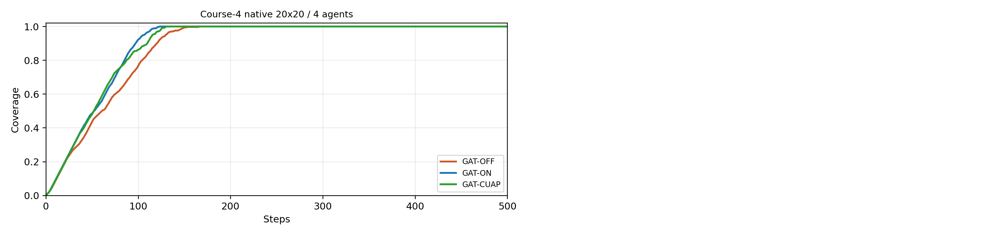
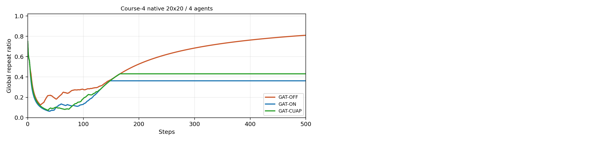
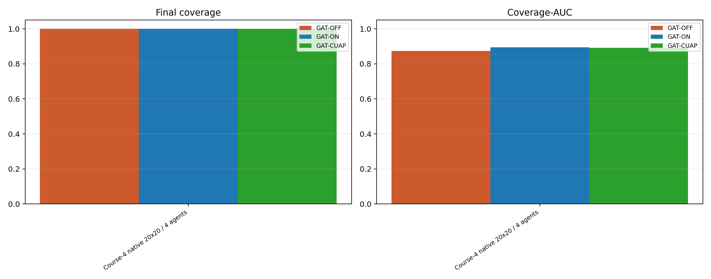
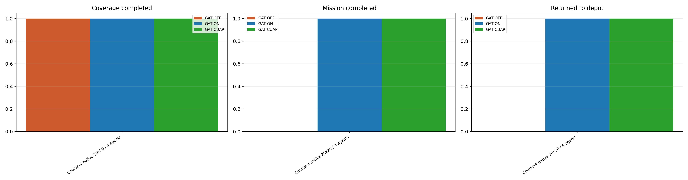
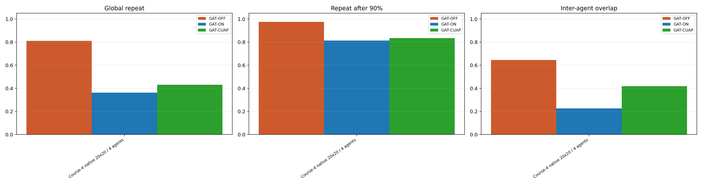
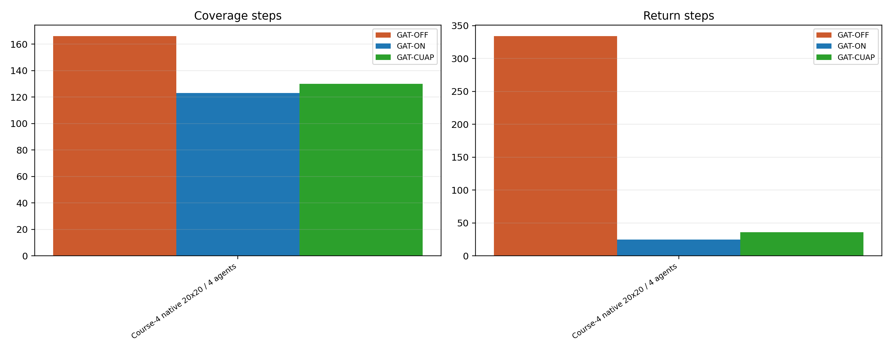
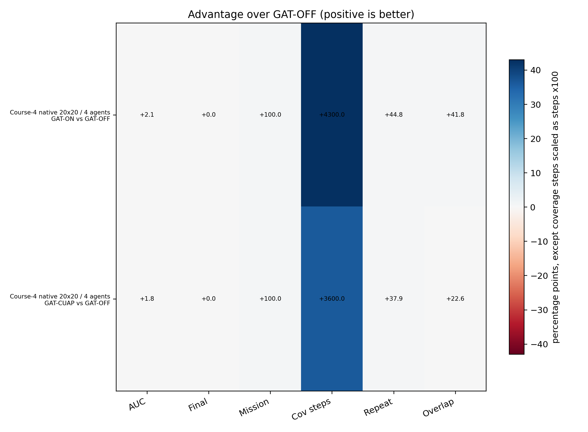

# Three-model ablation: GAT-OFF vs GAT-ON vs GAT-CUAP

This report evaluates trained checkpoints with deterministic offline rollouts. No additional PPO training is performed.

## Checkpoints

- GAT-OFF coverage: `D:\projects\GAT-MAPPO\MCPP\outputs\ablation_mapmsg_gat_off_nocomm\depot_return_pipeline\coverage\04-tier-4-20x20-4agents\best_policy.pt`
- GAT-ON coverage: `D:\projects\GAT-MAPPO\MCPP\outputs\ablation_mapmsg_gat_on\depot_return_pipeline\coverage\04-tier-4-20x20-4agents\best_policy.pt`
- GAT-CUAP coverage: `D:\projects\GAT-MAPPO\MCPP\outputs\ablation_mapmsg_gat_on_cuap\depot_return_pipeline\coverage\04-tier-4-20x20-4agents\best_policy.pt`
- Shared return policy: `D:\projects\GAT-MAPPO\MCPP\outputs\ablation_mapmsg_gat_off_nocomm\depot_return_pipeline\return_diverse_scale60\04-tier-4-20x20-4agents\policy.pt`

## Experimental Setup

- Task: depot-return coverage. The coverage policy acts until the environment enters return mode; all arms then use the same return policy.
- GAT-OFF is the no-communication explicit-memory baseline from `ablation_mapmsg_gat_off_nocomm`.
- GAT-ON enables shared map memory, coverage messages, and range-limited multi-head GAT.
- GAT-CUAP keeps the GAT-ON architecture and adds the CUAP action-prior logits during coverage.
- Main metrics: Coverage-AUC, final coverage, coverage completion, mission completion, coverage steps, repeated visits, and inter-agent overlap.

## Key Findings

- Best overall Coverage-AUC across non-native scenarios: GAT-OFF (nan%).
- Best overall final coverage across non-native scenarios: GAT-OFF (nan%).
- Best overall mission completion across non-native scenarios: GAT-OFF (nan%).
- Best overall global repeat across non-native scenarios: GAT-OFF (nan%).
- Best overall inter-agent overlap across non-native scenarios: GAT-OFF (nan%).
- GAT-CUAP vs GAT-ON average Coverage-AUC delta: +nan; global repeat delta: +nan.
- GAT-ON vs GAT-OFF average Coverage-AUC delta: +nan.
- Per-scenario Coverage-AUC wins: GAT-OFF: 0, GAT-ON: 1, GAT-CUAP: 0.

## Scenario Summary

| Scenario | Arm | Ep. | Final cov. | AUC | Cov done | Mission done | Returned | Steps | Cov steps | Return steps | Repeat90 | Overlap |
| --- | --- | ---: | ---: | ---: | ---: | ---: | ---: | ---: | ---: | ---: | ---: | ---: |
| Course-4 native 20x20 / 4 agents | GAT-OFF | 1 | 100.0% | 0.874 | 100.0% | 0.0% | 0.0% | 500.0 | 166.0 | 334.0 | 97.5% | 64.5% |
| Course-4 native 20x20 / 4 agents | GAT-ON | 1 | 100.0% | 0.894 | 100.0% | 100.0% | 100.0% | 148.0 | 123.0 | 25.0 | 81.4% | 22.6% |
| Course-4 native 20x20 / 4 agents | GAT-CUAP | 1 | 100.0% | 0.892 | 100.0% | 100.0% | 100.0% | 166.0 | 130.0 | 36.0 | 83.5% | 41.8% |

## Visual Summary

## Data Files

- Detail rows: `detail_rows.csv`
- Curve rows: `curve_rows.csv`
- Summary rows: `summary_rows.csv`

## Notes

- `Mission done` requires both full coverage and all agents returning to the depot before the step limit.
- `Coverage-AUC` is averaged over the full episode budget, so it rewards early coverage as well as final coverage.
- `Repeat90` is only meaningful after a trial reaches 90% coverage; trials that never reach 90% report zero for that field by the existing metric convention.
